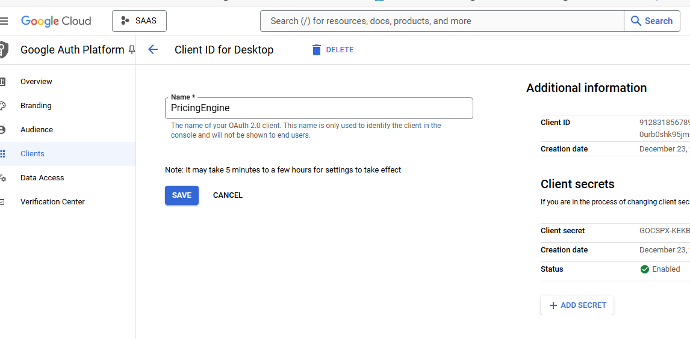

http://localhost:8080/auth/login/success

Setup Google cloud

1. Update GoogleLoginButton.js, GoogleOAuthProvider clientId= as in the above
2. In application.properties, update spring.security.oauth2.client.registration.google.client-id and spring.security.oauth2.client.registration.google.client-secret  as above. 
3. In addition, update the domain, to test locally spring.security.oauth2.client.registration.google.redirect-uri=http://localhost:8080/login/oauth2/code/google

To build, locally, 
1. from backend folder, run mvn clean install
2. To build frontend, run, npm run build
3. Then copy
   copy "\.\frontend\build\*" ".\backend\src\main\resources\static\"
4. then run mvn spring-boot:run

Only users who has google account can access it. At the same, we dont need to maintain any passwords and its enabled token based authentication.

Additional install before npm build run command:
npm install react-scripts --save

npm install react-google-login ==> gives error
npm install react-google-login --legacy-peer-deps
