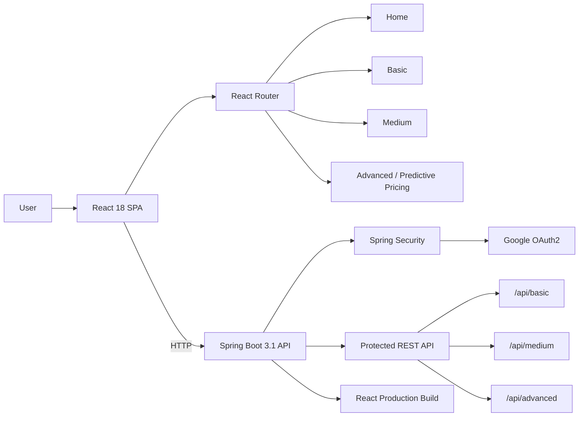
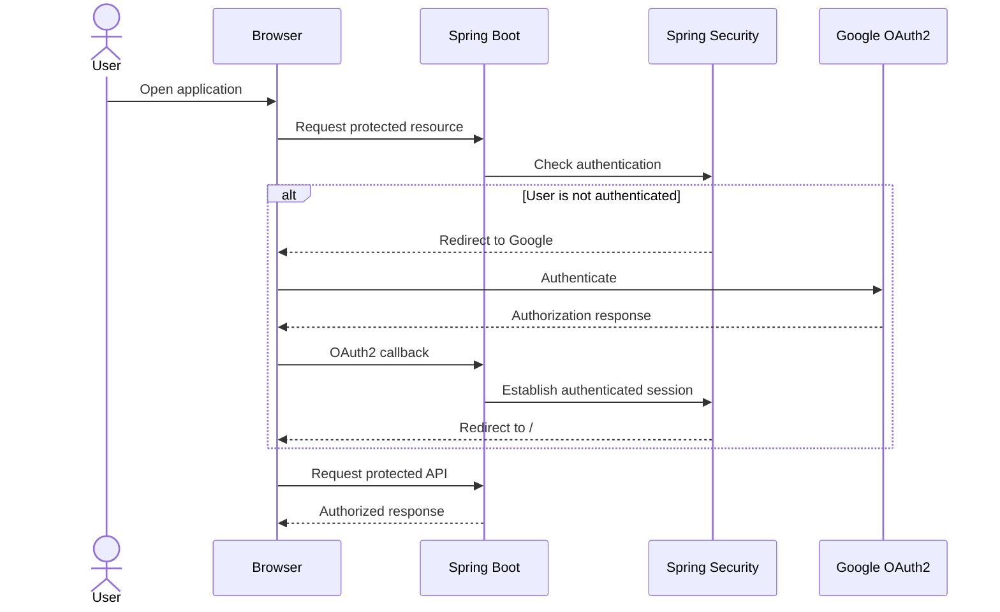
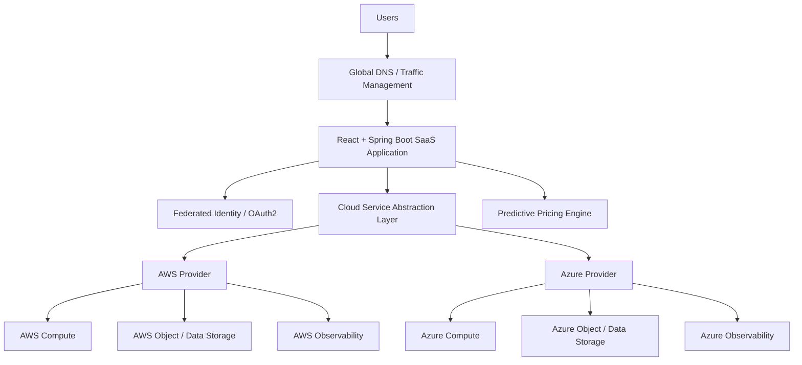
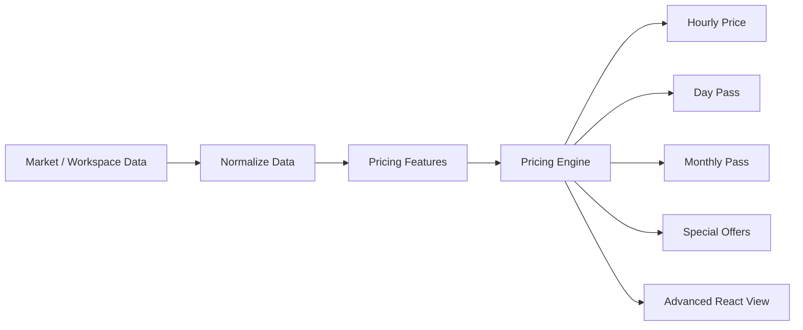
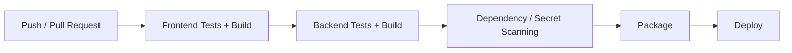
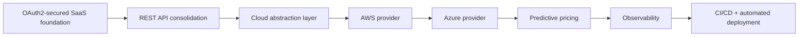

# MultiCloudProject

[](https://openjdk.org/)
[](https://spring.io/projects/spring-boot)
[](https://react.dev/)
[](https://spring.io/projects/spring-security)
[](https://developers.google.com/identity/protocols/oauth2)
[](https://maven.apache.org/)

**MultiCloudProject** is a full-stack SaaS application prototype built with **React**, **Spring Boot**, **Spring Security**, and **Google OAuth2**. It demonstrates a secure application architecture in which users authenticate with their Google identity and access protected application capabilities exposed through a Spring Boot backend.

The UI is organized into **Basic**, **Medium**, and **Advanced** capability levels. The Advanced view introduces the foundation for a **Predictive Pricing Engine**, making the project suitable as a starting point for a cloud-hosted SaaS pricing and market-research platform.

> **Current implementation note**
>
> Despite the project name, the current `main` branch primarily demonstrates the **application and authentication foundation**. No concrete AWS/Azure multi-cloud service integration is visible in the current source. The architecture below distinguishes the functionality that exists today from the logical multi-cloud evolution of the project.

---

## Table of Contents

- [Overview](#overview)
- [Current Architecture](#current-architecture)
- [Authentication Flow](#authentication-flow)
- [Technology Stack](#technology-stack)
- [Project Structure](#project-structure)
- [Application Features](#application-features)
- [API Endpoints](#api-endpoints)
- [Local Development](#local-development)
- [Google OAuth2 Setup](#google-oauth2-setup)
- [Production Build](#production-build)
- [Security](#security)
- [Multi-Cloud Evolution](#multi-cloud-evolution)
- [Predictive Pricing Engine](#predictive-pricing-engine)
- [Recommended Improvements](#recommended-improvements)
- [Roadmap](#roadmap)

---

## Overview

The application follows a classic SPA + REST backend architecture:

```text
Browser
   |
   v
React SPA
   |
   | HTTP / REST
   v
Spring Boot
   |
   +---- Spring Security
   |
   +---- Google OAuth2
   |
   +---- Protected REST APIs
```

Spring Boot can also serve the compiled React application from its static-resource directory, allowing the frontend and backend to be packaged as a single deployable application.

---

## Current Architecture



### Application layers

| Layer | Responsibility |
|---|---|
| React | Browser UI and navigation |
| React Router | `/`, `/basic`, `/medium`, `/advanced` routes |
| Spring Boot | REST API and application hosting |
| Spring Security | Request authentication and authorization |
| Google OAuth2 | External identity provider |
| API Controller | Basic, Medium, and Advanced protected APIs |
| Static resources | Production React bundle served by Spring Boot |

---

## Authentication Flow

The current backend uses Spring Security's OAuth2 login support.



The root path `/` is publicly accessible while other requests require authentication.

This design avoids maintaining application-specific passwords for Google-authenticated users.

---

## Technology Stack

### Frontend

- React 18.2
- React DOM
- React Router 6
- Axios
- Google OAuth libraries
- Create React App / `react-scripts`

### Backend

- Java
- Spring Boot 3.1.0
- Spring MVC
- Spring Security
- Spring Security OAuth2 Client
- JJWT libraries
- Maven

### Identity and Security

- Google OAuth2
- Spring Security
- JWT libraries included in the backend dependencies

> The active `SecurityConfig` currently relies on Spring Security OAuth2 login/session behavior. JWT libraries are present in the project, but the README should not imply that every protected request currently uses a custom JWT implementation.

---

## Project Structure

```text
MultiCloudProject/
│
├── README.md
├── img.png
│
├── frontend/
│   ├── package.json
│   ├── public/
│   ├── src/
│   │   ├── App.js
│   │   ├── BasicPage.js
│   │   ├── MediumPage.js
│   │   ├── AdvancedPage.js
│   │   ├── api.js
│   │   ├── index.js
│   │   └── components/
│   │       └── ...
│   └── build/
│
└── backend/
    ├── pom.xml
    ├── src/
    │   └── main/
    │       ├── java/com/example/springbootrestapi/
    │       │   ├── SpringBootRestApiApplication.java
    │       │   ├── config/
    │       │   │   ├── SecurityConfig.java
    │       │   │   └── CustomFilter.java
    │       │   ├── controller/
    │       │   │   ├── ApiController.java
    │       │   │   ├── AuthController.java
    │       │   │   ├── FrontendController.java
    │       │   │   └── CustomErrorController.java
    │       │   ├── entity/
    │       │   │   └── User.java
    │       │   └── service/
    │       │       └── UserService.java
    │       └── resources/
    │           ├── application.properties
    │           ├── static/
    │           └── templates/
    └── data/
```

---

## Application Features

### Home

The root route acts as the application entry point.

```text
/
```

### Basic capability

```text
/basic
```

Provides the Basic application view and is designed to interact with the backend's basic API capability.

### Medium capability

```text
/medium
```

Represents an intermediate SaaS capability tier.

### Advanced capability

```text
/advanced
```

Introduces the **Predictive Pricing Engine** UI.

The current Advanced page defines pricing dimensions for:

- Workspace type
- Hourly pricing
- Day passes
- Monthly passes
- Specials

This provides a UI foundation for future pricing intelligence and optimization logic.

---

## API Endpoints

The Spring Boot `ApiController` exposes three REST endpoints under `/api`.

### Basic

```http
GET /api/basic
```

Response:

```text
This is the BASIC API endpoint.
```

### Medium

```http
GET /api/medium
```

Response:

```text
This is the MEDIUM API endpoint.
```

### Advanced

```http
GET /api/advanced
```

Response:

```text
This is the ADVANCED API endpoint.
```

Because the Spring Security configuration requires authentication for requests other than `/`, these API endpoints are protected.

### Example

After establishing an authenticated browser session:

```bash
curl http://localhost:8080/api/basic
```

For automated API clients, the authentication model should be extended to support an explicit API token/JWT flow rather than relying solely on a browser OAuth2 session.

---

## Local Development

### Prerequisites

Install:

- Java compatible with Spring Boot 3.1
- Maven
- Node.js
- npm
- Git
- A Google Cloud OAuth2 application

### Clone

```bash
git clone https://github.com/Mahendira/SAAS-Workspace.git
cd SAAS-Workspace/MultiCloudProject
```

### Install frontend dependencies

```bash
cd frontend
npm install
```

If required by the existing dependency tree:

```bash
npm install react-scripts --save
```

The repository's original setup notes also mention the legacy Google login dependency:

```bash
npm install react-google-login --legacy-peer-deps
```

For new development, prefer keeping one supported Google authentication approach rather than maintaining multiple overlapping Google login libraries.

### Start the frontend

```bash
npm start
```

The React development server normally starts at:

```text
http://localhost:3000
```

### Start the backend

Open another terminal:

```bash
cd backend
mvn spring-boot:run
```

The backend runs at:

```text
http://localhost:8080
```

---

## Google OAuth2 Setup

Create an OAuth2 client in Google Cloud and configure the application for local development.

The backend callback is:

```text
http://localhost:8080/login/oauth2/code/google
```

Recommended configuration uses environment variables rather than credentials committed to the repository.

```properties
server.port=8080

spring.security.oauth2.client.registration.google.client-id=${GOOGLE_CLIENT_ID}
spring.security.oauth2.client.registration.google.client-secret=${GOOGLE_CLIENT_SECRET}
spring.security.oauth2.client.registration.google.redirect-uri=http://localhost:8080/login/oauth2/code/google
spring.security.oauth2.client.registration.google.scope=email,profile
```

Set the environment variables before starting the backend.

### macOS / Linux

```bash
export GOOGLE_CLIENT_ID="your-client-id"
export GOOGLE_CLIENT_SECRET="your-client-secret"
```

### PowerShell

```powershell
$env:GOOGLE_CLIENT_ID="your-client-id"
$env:GOOGLE_CLIENT_SECRET="your-client-secret"
```

Then:

```bash
mvn spring-boot:run
```

---

## Production Build

The project supports packaging the React build inside Spring Boot.

### 1. Build React

```bash
cd frontend
npm install
npm run build
```

This creates:

```text
frontend/build/
```

### 2. Copy the React build into Spring Boot

Copy the contents of:

```text
frontend/build/
```

to:

```text
backend/src/main/resources/static/
```

On Windows, for example:

```powershell
Copy-Item -Path ".\frontend\build\*" `
          -Destination ".\backend\src\main\resources\static\" `
          -Recurse -Force
```

### 3. Build Spring Boot

```bash
cd backend
mvn clean package
```

### 4. Run

```bash
java -jar target/spring-boot-rest-api-1.0-SNAPSHOT.jar
```

The compiled React SPA and Spring Boot API can then be delivered from the same application runtime.

---

## Security

### Current model

```text
User
  |
  v
Google Identity
  |
  v
OAuth2 Authorization
  |
  v
Spring Security
  |
  +---- Public /
  |
  +---- Protected application/API routes
```

Spring Security currently configures:

```text
/                  -> permitAll()
all other requests -> authenticated()
```

OAuth2 login redirects successfully authenticated users back to `/`.

### Secret management

**Never commit OAuth client secrets, JWT signing secrets, passwords, or cloud credentials to Git.**

Use environment variables, CI/CD secret stores, or cloud-native secret-management services.

Example:

```properties
jwt.secret=${JWT_SECRET}
spring.security.oauth2.client.registration.google.client-id=${GOOGLE_CLIENT_ID}
spring.security.oauth2.client.registration.google.client-secret=${GOOGLE_CLIENT_SECRET}
```

> **Security action required:** if real OAuth or JWT secrets have previously been committed to the repository, treat them as exposed and rotate/revoke them. Removing them only from the latest file does not remove them from Git history.

---

# Multi-Cloud Evolution

The current application establishes the **portable application layer** needed for a future multi-cloud SaaS architecture, but AWS/Azure-specific runtime integrations are not currently implemented in `main`.

A future architecture could look like this:



The important design principle is to avoid scattering cloud-specific SDK calls throughout controllers and business services.

Instead:

```text
Business Service
      |
      v
CloudService interface
      |
      +----------------+
      |                |
      v                v
AwsCloudService   AzureCloudService
```

This keeps domain logic cloud-neutral while allowing provider-specific implementations.

### Example Java abstraction

```java
public interface CloudService {

    CloudResource provision(ResourceRequest request);

    CloudResource getResource(String resourceId);

    void deleteResource(String resourceId);

    CloudMetrics getMetrics(String resourceId);
}
```

Provider implementations could then be introduced independently:

```text
AwsCloudService
AzureCloudService
```

This approach supports portability, testability, failover strategies, and provider selection without coupling the core application directly to one cloud vendor.

---

# Predictive Pricing Engine

The Advanced page provides the beginning of a pricing-engine experience.



A production implementation could consider:

```text
Workspace Type
Location
Capacity
Historical Occupancy
Competitor Pricing
Time of Day
Day of Week
Seasonality
Demand
Availability
Promotions
Historical Conversion
```

The first version should use deterministic pricing rules and measurable market statistics. Predictive or generative AI can then augment those calculations with forecasting and explanations.

---

## Recommended Improvements

### 1. Separate authentication from business APIs

Introduce explicit API authentication for SPA/API calls rather than depending entirely on browser OAuth2 session state.

### 2. Consolidate Google authentication libraries

The frontend currently includes both:

```text
@react-oauth/google
react-google-login
```

Prefer a single supported authentication integration.

### 3. Correct frontend/backend API contracts

Keep all REST URLs behind a shared frontend API client and use consistent paths such as:

```text
/api/basic
/api/medium
/api/advanced
```

Avoid hard-coding backend URLs directly in individual React components.

Example:

```javascript
const api = axios.create({
  baseURL: process.env.REACT_APP_API_BASE_URL || '/api'
});
```

### 4. Externalize configuration

Use environment-specific configuration for:

```text
OAuth client ID
OAuth client secret
JWT signing key
API base URL
Cloud provider configuration
```

### 5. Clean generated artifacts from Git

The repository currently contains generated/build-oriented directories and files. In general, avoid committing:

```text
node_modules/
frontend/build/
backend/target/
.idea/
*.mv.db
*.trace.db
```

unless there is a deliberate reason to version them.

### 6. Add automated tests

Recommended test layers:

```text
React component tests
Controller tests
Spring Security tests
OAuth2 integration tests
Service unit tests
API integration tests
End-to-end tests
```

### 7. Add CI/CD

A future GitHub Actions pipeline could perform:



### 8. Containerize the application

Add:

```text
frontend/Dockerfile
backend/Dockerfile
docker-compose.yml
```

or package the React static build directly into the Spring Boot container.

### 9. Add observability

Capture:

- Request latency
- Authentication failures
- API errors
- Application exceptions
- Pricing-engine latency
- Cloud-provider latency
- Availability
- Business metrics

---

## Roadmap



### Phase 1 — Application foundation

- React SPA
- Spring Boot REST backend
- Google OAuth2
- Protected application routes

### Phase 2 — API and security modernization

- Unified REST API client
- Token-based API authorization
- Externalized secrets
- Automated security testing

### Phase 3 — Multi-cloud capability

- Cloud-provider abstraction
- AWS implementation
- Azure implementation
- Provider selection/failover policies
- Cloud-neutral domain services

### Phase 4 — Pricing intelligence

- Workspace market-data model
- Historical pricing
- Pricing rules
- Demand forecasting
- Predictive pricing recommendations

### Phase 5 — Production engineering

- Docker
- CI/CD
- Infrastructure as Code
- Metrics/tracing/logging
- Automated tests
- Resilience patterns
- Cloud deployment

---

## Design Principles

The project is intended to evolve around several core engineering principles:

**Secure by default** — authentication and authorization are handled centrally through Spring Security and federated identity.

**Cloud portable** — business logic should remain independent from AWS/Azure-specific SDKs.

**API driven** — frontend capabilities communicate through well-defined backend APIs.

**Incrementally extensible** — Basic, Medium, and Advanced capabilities provide a natural progression for SaaS functionality.

**Pricing intelligence** — the Advanced capability can evolve into a data-driven predictive pricing service.

---

## Repository

This project lives under:

```text
SAAS-Workspace/
└── MultiCloudProject/
```

GitHub repository:

```text
Mahendira/SAAS-Workspace
```

---

## License

No license is currently specified for this project.

If the repository will be distributed or reused publicly, add a `LICENSE` file and document the selected license here.
